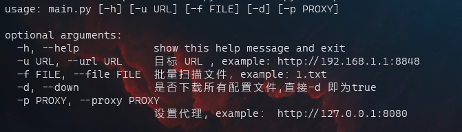

# Nacos_scan
## 简介
Nacos_scan是一款基于python的Nacos服务漏洞扫描工具。

**已集成漏洞**
- Nacos默认密码
- Nacos默认密钥
- Nacos V1 API 未授权访问
- Nacos-Server身份验证绕过
- ServerIdentity鉴权绕过
- Nacos 未授权SQL语句执行
- Nacos 集群反序列化漏洞(版本号判断)
- Nacos Jraft 文件读写漏洞(版本号判断)

## 使用

注：使用下载配置文件选项后会将Nacos服务端的配置文件下载到config_zip文件夹中，然后在file_list_md文件夹中生成md格式文档，并使用keywords.py对md中的敏感词进行标注。

## 声明
本工具仅能在取得足够合法授权的企业安全建设中使用，在使用本工具过程中，您应确保自己所有行为符合当地的法律法规。

如您在使用本工具的过程中存在任何非法行为，您将自行承担所有后果，本工具所有开发者和所有贡献者不承担任何法律及连带责任。

除非您已充分阅读、完全理解并接受本协议所有条款，否则，请您不要安装并使用本工具。

您的使用行为或者您以其他任何明示或者默示方式表示接受本协议的，即视为您已阅读并同意本协议的约束。